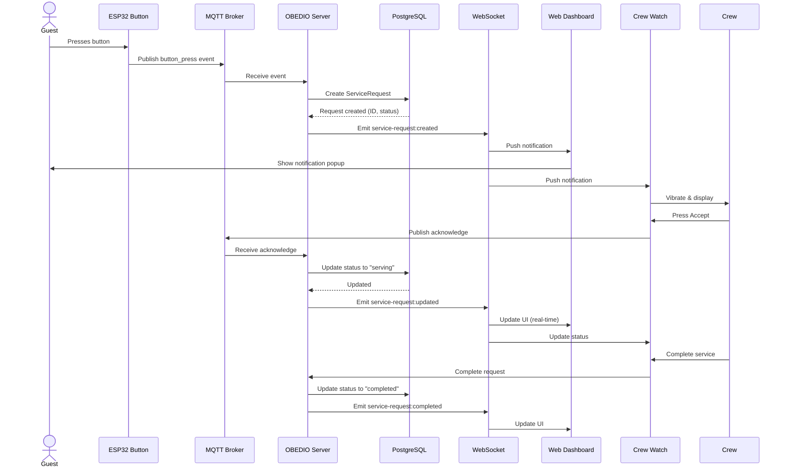
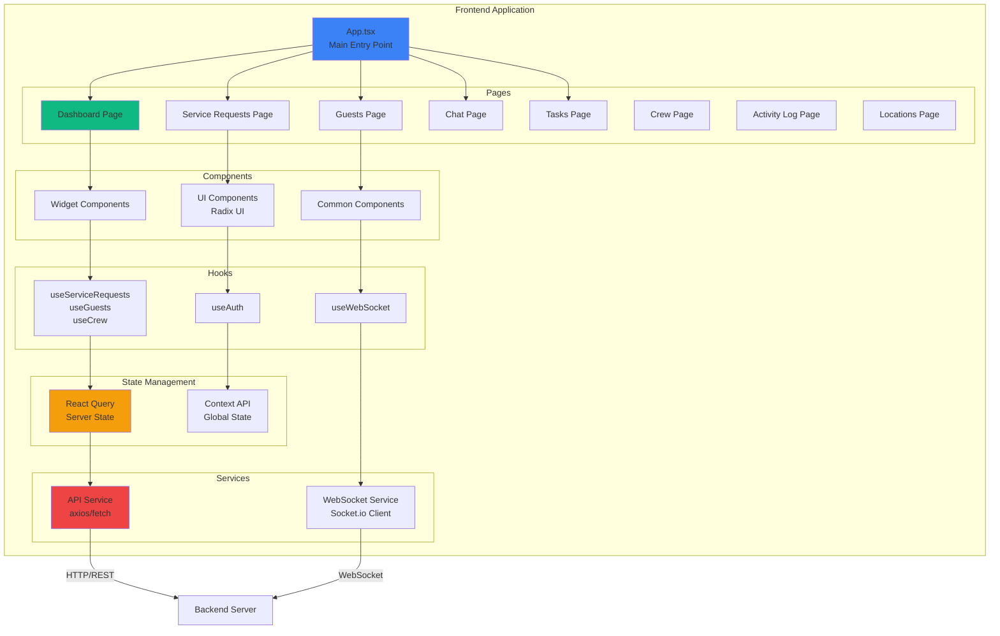
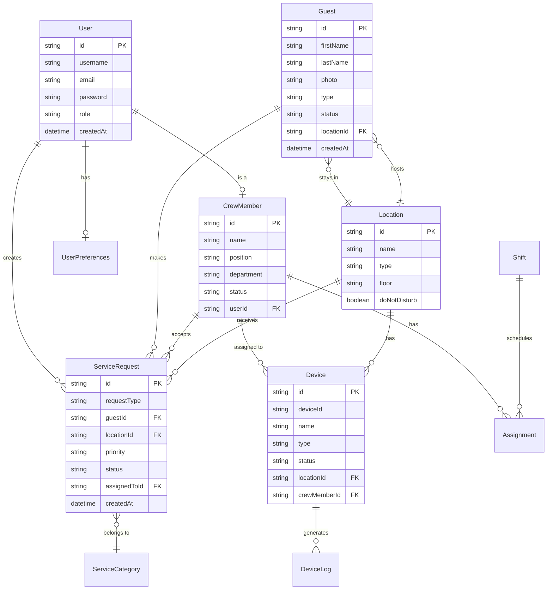
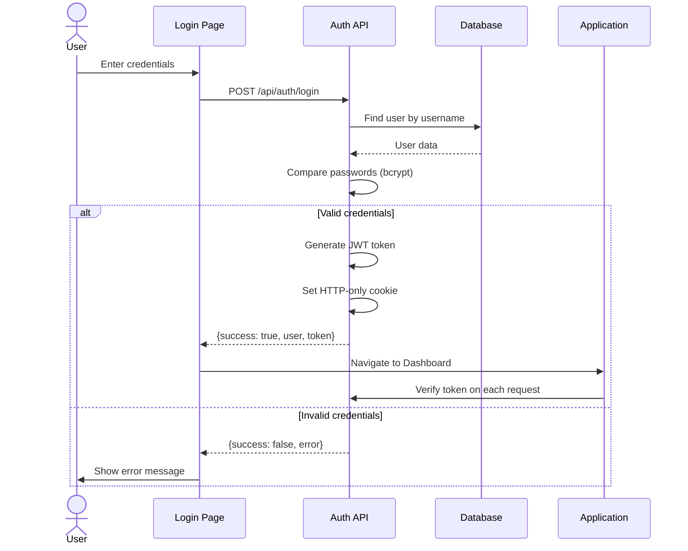
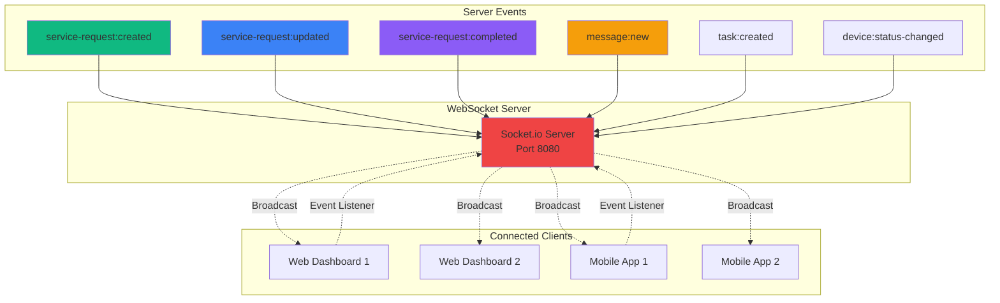
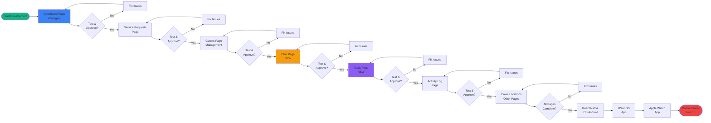
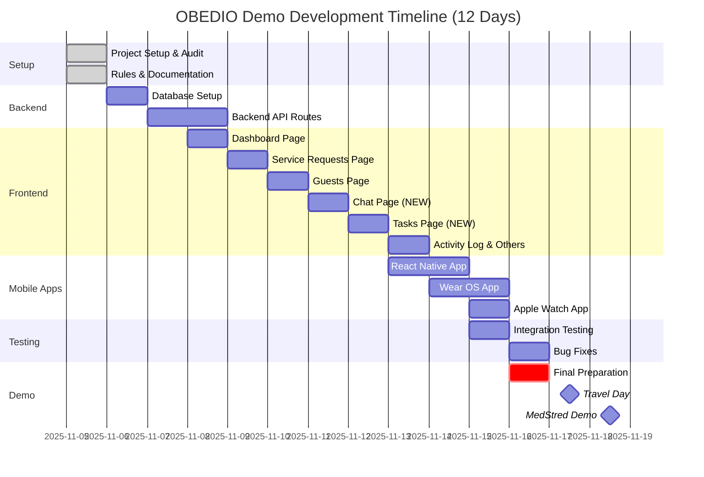

```mermaid
graph TB
    subgraph "Client Devices"
        ESP32[ESP32 Smart Buttons]
        Mobile[iOS/Android Apps<br/>React Native]
        Web[Web Dashboard<br/>React]
        WearOS[Wear OS App<br/>Kotlin]
        AppleWatch[Apple Watch App<br/>Swift]
    end

    subgraph "OBEDIO Server"
        API[Express API Server<br/>Port 8080]
        WS[WebSocket Server<br/>Socket.io]
        MQTT[MQTT Service<br/>Mosquitto]
        DB[(PostgreSQL<br/>Database)]
    end

    subgraph "Real-Time Communication"
        MQTT_Broker[MQTT Broker<br/>Port 1883]
    end

    ESP32 -.MQTT.-> MQTT_Broker
    MQTT_Broker --> MQTT

    Mobile -->|HTTP/REST| API
    Mobile -->|WebSocket| WS

    Web -->|HTTP/REST| API
    Web -->|WebSocket| WS

    WearOS -.MQTT.-> MQTT_Broker
    AppleWatch -.MQTT.-> MQTT_Broker

    API --> DB
    MQTT --> DB
    WS --> DB

    MQTT -->|Emit Events| WS
    API -->|Emit Events| WS

    style ESP32 fill:#C8A96B
    style Mobile fill:#3B82F6
    style Web fill:#10B981
    style WearOS fill:#F59E0B
    style AppleWatch fill:#8B5CF6
    style API fill:#EF4444
    style DB fill:#1E293B
```

# 🏗️ ARCHITECTURE DIAGRAMS - Mermaid
**Created:** 2025-11-05
**Purpose:** Visual representation of OBEDIO system architecture

---

## 📊 SYSTEM OVERVIEW



---

## 🔄 SERVICE REQUEST FLOW



---

## 📱 FRONTEND ARCHITECTURE



---

## 🗄️ DATABASE SCHEMA (Simplified)



---

## 🔐 AUTHENTICATION FLOW



---

## 🌐 API ARCHITECTURE

```mermaid
graph LR
    subgraph "Client Requests"
        Client[Client<br/>Web/Mobile]
    end

    subgraph "Express Middleware Chain"
        CORS[CORS Handler]
        RateLimit[Rate Limiter]
        Auth[Auth Middleware]
        Validate[Request Validation]
        ErrorHandler[Error Handler]
    end

    subgraph "API Routes"
        AuthRoute[/api/auth]
        GuestsRoute[/api/guests]
        ServiceRoute[/api/service-requests]
        CrewRoute[/api/crew]
        LocationsRoute[/api/locations]
        MessagesRoute[/api/messages]
        TasksRoute[/api/tasks]
    end

    subgraph "Business Logic"
        DBService[Database Service]
        WSService[WebSocket Service]
        MQTTService[MQTT Service]
    end

    subgraph "Data Layer"
        Prisma[Prisma ORM]
        DB[(PostgreSQL)]
    end

    Client -->|HTTP Request| CORS
    CORS --> RateLimit
    RateLimit --> Auth
    Auth --> Validate

    Validate --> AuthRoute
    Validate --> GuestsRoute
    Validate --> ServiceRoute
    Validate --> CrewRoute
    Validate --> LocationsRoute
    Validate --> MessagesRoute
    Validate --> TasksRoute

    AuthRoute --> DBService
    GuestsRoute --> DBService
    ServiceRoute --> DBService
    ServiceRoute --> WSService
    ServiceRoute --> MQTTService

    DBService --> Prisma
    Prisma --> DB

    DBService -->|Response| ErrorHandler
    ErrorHandler -->|JSON| Client

    WSService -.Real-time Updates.-> Client

    style Client fill:#3B82F6
    style Auth fill:#EF4444
    style DBService fill:#10B981
    style DB fill:#1E293B
```

---

## 📡 REAL-TIME UPDATES (WebSocket)



---

## 📋 PAGE-BY-PAGE WORKFLOW



---

## 🎯 DEVELOPMENT TIMELINE (Mermaid Gantt)



---

## 🔄 DATA FLOW: Button Press → Notification

```mermaid
flowchart TD
    Start([Guest needs service]) --> Press[Guest presses<br/>ESP32 button]

    Press --> MQTT{MQTT Topic:<br/>obedio/button/+/press}

    MQTT --> Server[OBEDIO Server<br/>receives message]

    Server --> Parse[Parse button data:<br/>deviceId, pressType,<br/>battery, location]

    Parse --> DeviceCheck{Device<br/>exists in DB?}

    DeviceCheck -->|No| CreateDevice[Auto-create<br/>virtual device]
    CreateDevice --> FindGuest

    DeviceCheck -->|Yes| FindGuest[Find guest<br/>by location]

    FindGuest --> DerivePriority[Derive priority<br/>from pressType:<br/>single/double/long/shake]

    DerivePriority --> CreateRequest[Create ServiceRequest<br/>in PostgreSQL]

    CreateRequest --> LogActivity[Log to<br/>ActivityLog]

    LogActivity --> EmitWS[Emit WebSocket event:<br/>service-request:created]

    EmitWS --> NotifyDash[Notify Web Dashboard<br/>Real-time popup]

    EmitWS --> NotifyWatch[Notify Crew Watch<br/>via MQTT]

    NotifyDash --> ShowPopup[Show notification<br/>with sound/vibration]

    NotifyWatch --> WatchVibrate[Watch vibrates<br/>Shows guest info]

    ShowPopup --> Accept[Crew presses<br/>Accept button]

    Accept --> UpdateStatus[Update status<br/>to 'serving']

    UpdateStatus --> EmitUpdate[Emit:<br/>service-request:updated]

    EmitUpdate --> UpdateUI[Update all<br/>connected clients]

    UpdateUI --> Complete[Crew completes<br/>service]

    Complete --> MarkComplete[Update status<br/>to 'completed']

    MarkComplete --> End([Service completed!])

    style Start fill:#10B981
    style Press fill:#C8A96B
    style CreateRequest fill:#3B82F6
    style NotifyDash fill:#F59E0B
    style NotifyWatch fill:#8B5CF6
    style End fill:#EF4444
```



---

**END OF ARCHITECTURE DIAGRAMS**

**Created:** 2025-11-05
**Purpose:** Visual guide for understanding OBEDIO system
**Format:** Mermaid (renders on GitHub, GitLab, Notion, VS Code)

**How to view:**
- GitHub: Automatically renders
- VS Code: Install "Markdown Preview Mermaid Support" extension
- Online: https://mermaid.live (paste code)
